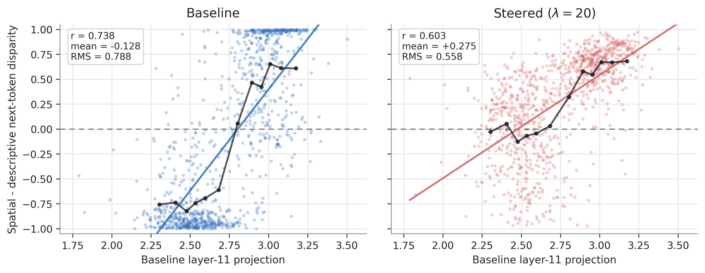

# Spatial Language Steering for Image Descriptions

<p align="center">
  <a href="docs/Haas_Brett_TechnicalReport.pdf"><strong>Read the technical report</strong></a>
  &nbsp;|&nbsp;
  <a href="#quick-start"><strong>Run the pipeline</strong></a>
  &nbsp;|&nbsp;
  <a href="#repository-map"><strong>Explore the code</strong></a>
</p>

<p align="center">
  
  
  
  
</p>

<p align="center">
  
</p>

This repository contains the code and selected artifacts behind **"Steering Image Descriptions Toward Spatial Language: An Accessibility-Motivated Activation Steering Study."** The project asks whether activation steering can shift an image-description model away from appearance-heavy language and toward spatial relations such as left, behind, above, and next to, while keeping generated text coherent.

The work is accessibility-motivated: blind users often need layout and relation information that generic captions under-supply. The experiments do not claim user benefit directly; they test a narrower systems question: **is spatial language controllable at inference time, and where does that control break down?**

## What This Project Does

- Extracts spatial-vs-descriptive steering directions from residual-stream activations.
- Scores model behavior with a constrained-softmax metric over 51 spatial terms and 65 descriptive terms.
- Applies orthogonal-projection steering without retraining or fine-tuning model weights.
- Evaluates the trade-off between raw bias reduction and coherent generation.
- Compares local Qwen-1.8B results with imported Rivanna sweeps across Qwen2.5 base and instruct checkpoints.

## Headline Findings

| Result | Model / setting | Finding |
|---|---:|---|
| Strongest raw shift | Qwen-1.8B-chat, validation sweep | 93.0% RMS bias reduction, but the most aggressive setting was unstable |
| Coherent full-sequence steering | Qwen-1.8B-chat, `B_positioned` frontier | 33.3% RMS reduction while preserving heuristic coherence |
| Coherent 1-token steering | Qwen-1.8B-chat, `B_positioned` frontier | 67.2% RMS reduction with less cumulative degeneration |
| Cross-model pattern | Qwen2.5 3B and 7B | Base checkpoints were more steerable than matched instruct checkpoints |

The main technical lesson is that next-token control is much easier than full-continuation control. A model can contain a strong spatial direction, but repeatedly applying that direction across an autoregressive sequence can make the text brittle.

## How It Works

1. **Build contrastive prompts** from COCO-derived captions labeled as spatial or descriptive.
2. **Collect hidden states** from each transformer layer under caption-conditioned prompts.
3. **Extract candidate vectors** using a weighted mean difference between the two language poles.
4. **Select steering layers** by validating how well each direction explains held-out spatial-descriptive bias.
5. **Intervene during generation** by replacing the activation projection and adding a tunable steering coefficient.
6. **Measure both movement and quality** with RMS bias reduction, prompt-family sweeps, and coherence-frontier checks.

## Quick Start

```bash
python3 -m venv .venv
source .venv/bin/activate
pip install -r requirements.txt
```

Run the main training and validation pipeline:

```bash
python -m bias_steering.run \
  --model_name Qwen/Qwen-1_8B-chat \
  --target_concept vision \
  --pos_label spatial \
  --neg_label descriptive \
  --n_train_per_label 1500 \
  --n_val 1000 \
  --constrained_softmax \
  --score_mode prob_diff \
  --optimize_coeff \
  --coeff_search_min -200 \
  --coeff_search_max 200 \
  --coeff_search_increment 10 \
  --save_dir runs_vision
```

Regenerate the local sweep panels used for qualitative inspection:

```bash
python run_local_sweep.py
```

Rebuild the tracked projection scatter figure:

```bash
python plotting/build_qwen_image_shows_projection_scatter.py \
  --lambdas 0 10 20 \
  --final-lambda 20
```

## Repository Map

```text
vision-bias-steering/
├── bias_steering/                 core data, model, steering, and eval code
│   ├── data/                      COCO-derived split loaders and templates
│   ├── steering/                  vector extraction and intervention logic
│   └── eval/                      task and generation logging utilities
├── experiments/
│   ├── coherence_frontier/        coherence-vs-reduction sweep tooling
│   ├── prompt_template_search/    prompt-family diagnostics
│   └── rivanna/                   cross-model batch scripts and summaries
├── plotting/                      paper and diagnostic figure builders
├── paper/figures/                 selected committed figures for the report
├── docs/                          portfolio-facing report PDF
├── run_local_sweep.py             local caption sweep entry point
├── run_multimodel_sweep.py        multi-model sweep runner
├── test_multimodel_sweep.py       multi-model sweep regression test
└── test_prompt_steering.py        prompt-steering regression test
```

## Key Files

| File | Purpose |
|---|---|
| `bias_steering/run.py` | Main CLI for training, validation, coefficient search, handcrafted eval, and generation logs |
| `bias_steering/steering/intervention.py` | Activation intervention implementations |
| `bias_steering/steering/extract.py` | Candidate steering-vector extraction |
| `bias_steering/data/datasets/target_words.json` | Spatial and descriptive target-word inventory |
| `experiments/rivanna/run_experiment.py` | Cross-model experiment runner used for cluster sweeps |
| `plotting/build_qwen_image_shows_projection_scatter.py` | Rebuilds the README/report diagnostic figure |

## Notes For Reviewers

- Large raw datasets, model activations, local result bundles, and generated plots are intentionally ignored.
- The committed figures are selected paper artifacts, not the full experiment archive.
- The technical report frames accessibility as motivation, not as a completed user study. The next evaluation step would be blind-user or task-based assessment of whether spatially steered descriptions are actually more useful.

## License

This project keeps the upstream MIT license in `LICENSE`.
